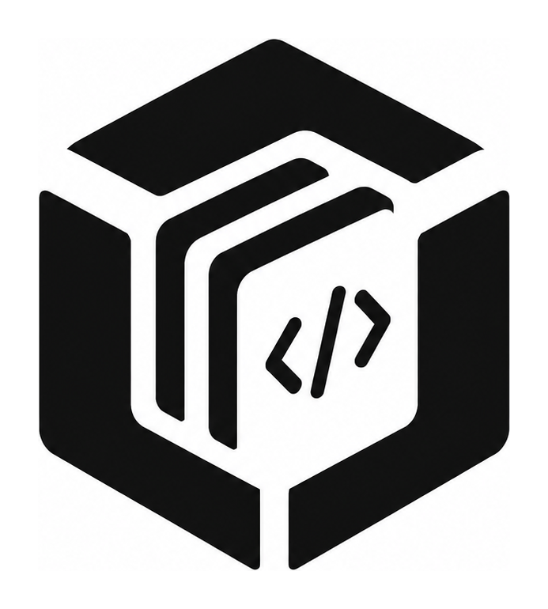

<div align="center">

<picture>
  <source media="(prefers-color-scheme: dark)" srcset="public/brand/pagepod-logo-dark.png">
  <source media="(prefers-color-scheme: light)" srcset="public/brand/pagepod-logo-monochrome.png">
  
</picture>

# Pagepod

<p><strong>专为 AI Artifacts 与单页 HTML 应用打造的开源自建展示、沙箱与托管平台。</strong><br>
在你自己的私有服务器或云平台上托管并安全运行来自 Claude Artifacts、ChatGPT Canvas、v0、Bolt 与 Cursor 的交互作品 —— 零构建流水线、物理级沙箱隔离与零下行流量费用。</p>

<p>
  <a href="https://github.com/QingYunA/html-manager/releases"></a>
  <a href="https://hub.docker.com/"></a>
  <a href="https://coolify.io/"></a>
  <a href="https://vercel.com/new/clone?repository-url=https%3A%2F%2Fgithub.com%2FQingYunA%2Fhtml-manager&env=ADMIN_PASSWORD&envDescription=Set%20a%20master%20password%20for%20accessing%20the%20admin%20dashboard&stores=%5B%7B%22type%22%3A%22postgres%22%7D%2C%7B%22type%22%3A%22blob%22%7D%5D"></a>
  <a href="LICENSE"></a>
</p>

<p>
  <a href="https://pagepod.dev">官方网站</a> ·
  <a href="https://pagepod.dev/explore">在线演示</a> ·
  <a href="#部署方案">部署方案</a> ·
  <a href="#核心架构">核心架构</a> ·
  <a href="#对比矩阵">对比矩阵</a> ·
  <a href="https://pagepod.dev/api/docs">API 文档</a> ·
  <a href="README.md">English</a>
</p>

</div>

---

## 关于项目

Pagepod 是专为 AI 时代设计的 **CodePen / JSFiddle / 静态对象存储托管** 开源自托管替代方案。

大语言模型（Claude、ChatGPT、v0、Bolt、Cursor）能够在数秒内生成极具实用价值的交互式 Web 网页、Canvas 小游戏、数据看板与原型工具。然而在实际使用与沉淀过程中，开发者普遍面临三大痛点：

1. **淹没在对话历史中**：会话归档或删除后，生成的精美 Artifacts 难以再次找回与长期复用。
2. **裸跑外部代码的安全隐患**：直接在自己主站域名下运行未知的 AI 生成 JavaScript，存在 Cookie 泄露、管理员凭证窃取与 XSS 越权的严重风险。
3. **平台厂商锁定与高昂成本**：传统代码分享平台限制多文件静态资源上传，或按月强制收取会员费；自建对象存储又面临高昂的公网下行流量（Egress）账单。

**Pagepod 为此提供主权在己的自建沙箱解决方案：**
- **拒绝厂商绑定（No Vendor Lock-in）**：所有上传的 HTML 源码、静态素材与数据库记录，均完全存放在你自己的服务器或你掌控的 S3/R2 存储桶中。
- **物理隔绝沙箱**：运行端点通过严格的 CSP 策略物理隔绝，第三方脚本无法读取主站 Cookie 或管理员会话。
- **零构建流水线**：单文件 `.html` 或多资源 `.zip` 即传即开，无需配置 Webpack / Vite 或设置 npm 构建命令。
- **自由基础设施**：可以在 4 美元/月的 VPS（Hetzner、DigitalOcean）、Docker / Coolify / Portainer 容器环境、软路由/树莓派，或免费托管在 Vercel。

---

## 自托管 vs. 官方云端托管

| 维度 | 自托管 Pagepod（本仓库） | Pagepod Cloud（官方托管版） |
| :--- | :--- | :--- |
| **软件授权与费用** | **100% 免费且开源（MIT 协议）** | 免费版与终身制会员 |
| **基础设施** | 自由部署于 VPS、Coolify、Docker 或 Vercel | 全球高可用托管云集群 |
| **数据所有权** | 100% 掌握在你自己的硬件或对象存储中 | 托管云端安全存储 |
| **日常维护** | 自主控制升级节奏与备份策略 | 零运维，自动备份与无缝平滑更新 |
| **自定义域名** | 支持无限自定义域名（通过反向代理 / Caddy） | 原生提供二级子域名分发与路由 |
| **即刻上手** | [查看自托管部署说明](#部署方案) | [访问 pagepod.dev](https://pagepod.dev) |

---

```
┌─────────────────────────────────────────────────────────────────────────────┐
│                       AI Artifact Ingestion Pipeline                        │
│                                                                             │
│  Claude Artifacts / ChatGPT Canvas / v0 / Cursor 生成 HTML 产物              │
│         │                                        │                          │
│         ▼                                        ▼                          │
│   Web 控制台 (拖拽 / Zip / 代码粘贴)       POST /api/upload (CLI / PAT 鉴权)  │
│         │                                        │                          │
│         └───────────────────┬────────────────────┘                          │
│                             ▼                                               │
│                 Pagepod Platform Core (Next.js 16)                          │
│                             │                                               │
│    ┌────────────────────────┼────────────────────────┐                      │
│    ▼                        ▼                        ▼                      │
│  可插拔存储适配器      Drizzle ORM 数据层     安全物理沙箱防护体系          │
│  • 本地硬盘存储 (.storage)• PostgreSQL (Neon/DB) • 严格 CSP: 拦截提权行为   │
│  • Cloudflare R2 (零流量费)• Supabase SSR 鉴权    • 独立内存 Storage 隔离环境 │
│  • Vercel Blob        • 轻量本地 JSON 降级   • 物理切断主域 Cookie 访问    │
│    │                        │                        │                      │
│    └────────────────────────┼────────────────────────┘                      │
│                             ▼                                               │
│         ┌───────────────────┴───────────────────┐                           │
│         ▼                                       ▼                           │
│  公开发现画廊 (/explore)                全功能运行台 (/p/[slug])            │
│  • Zinc 极简点阵技术海报                • 桌面 / 平板 / 手机三端视口切换    │
│  • 悬停 600ms 环形蓄力启动              • 独立纯净沙箱直链 (/raw/)          │
│  • LRU 队列硬限 6 个活跃沙箱            • 源码高亮查看与一键复制            │
└─────────────────────────────────────────────────────────────────────────────┘
```

---

## 对比矩阵

| 核心特性 | Pagepod (自建方案) | CodePen / JSFiddle | v0 / Bolt 原型预览 | 静态 S3 / R2 直出 |
| :--- | :---: | :---: | :---: | :---: |
| **私有化自建部署** | **支持 (VPS / Docker)** | 不支持 (纯云端 SaaS) | 不支持 (纯云端 SaaS) | 支持 |
| **物理隔离 CSP 沙箱** | **支持 (`/raw/` 独立端点)** | 部分隔离 | 部分隔离 | 无 (与存储桶同域风险) |
| **Zip 压缩包与多静态资源解压** | **支持 (自动相对路径映射)** | 仅付费版支持 | 限制支持 | 需手动上传维护 |
| **多端响应式模拟 (桌面/平板/手机)** | **支持 (一键切换)** | 需手动拖拽 | 支持 | 无 |
| **自动化 CLI 与 Agent API (`/api/upload`)** | **支持 (OpenAPI + PAT)** | 不支持 | 不支持 | 仅限云厂商 S3 CLI |
| **首屏性能守护 (无 GPU 内存尖峰)** | **支持 (点阵海报 + LRU 限 6)** | 无 (并发多 iframe 卡顿) | 并发大量 iframe | 不适用 |
| **客户端端到端零知识加密 (E2EE)** | **支持 (AES-GCM Web Crypto)**| 不支持 | 不支持 | 不支持 |
| **公网下行流量费用 (Egress)** | **0 元 (R2 免费额度或本地硬盘)**| 订阅年费制 | 订阅年费制 | 产生公网流量账单 |

---

## 核心特性

- **严格物理安全沙箱：** 托管的所有 HTML 运行端点均指向独立的 `/raw/[slug]/`，强制注入严格 CSP 响应头（`sandbox allow-scripts allow-forms allow-downloads allow-popups allow-modals; default-src * 'unsafe-inline' 'unsafe-eval' data: blob:`），且坚决不赋予 `allow-same-origin`，物理隔绝访问宿主主域的 Cookie、管理员 Session 与 LocalStorage。
- **静态底图与双核悬浮胶囊：** 展示卡片默认呈现轻量级 Zinc 技术点阵海报与分类专属线框图形，杜绝全量 iframe 直出导致的性能骤降；支持直接点击或 600ms 悬停蓄力载入，全局由 LRU 队列硬限制最多同时保持 6 个活跃沙箱。
- **体积预警与超时守护防护体系：** 文件体积超过 2MB 时在卡片标注微型胶囊预警；内置 6.5 秒加载超时自动阻断机制，隔离异常死循环脚本，保障主站性能不受拖累。
- **多形态极速入库：** 原生支持单文件 `.html` 拖拽或选择上传、包含多层相对静态资源的 `.zip` 压缩包自动解压平铺、直接粘贴源码并智能提取 `<title>` 与 `<meta description>`，以及内置 CodeMirror 在线代码编辑器。
- **多端交互式运行台 (`/p/[slug]`)：** 提供一键切换**桌面端 (100%)**、**平板端 (768px)**、**手机端 (375px)** 响应式视口模拟、浏览器原生全屏、格式化源码查看与一键复制，以及独立的 `/raw/[slug]/` 纯净外链引用端点。
- **OpenAPI 3.1 规范与 Agent 自动化流：** 原生提供基于 Personal Access Token (`pp_live_...`) 鉴权的 `POST /api/upload` 开放端点，在 Cursor、Claude Code 或终端流水线中通过一行命令直接完成上传与发布；内置 Scalar 交互式文档中心 (`/api/docs`)。
- **零厂商锁定存储与数据库：** 抽象 `getStorage()` 存储接口，自动按顺序探测本地持久化目录 (`.storage/`)、Cloudflare R2（S3 兼容协议，零公网流量费）与 Vercel Blob；Drizzle ORM 支持 PostgreSQL（Vercel Postgres、Neon、Supabase），并在本地无外部数据库配置时自动降级到 `.data/db.json`。
- **账号级隐私隔离与端到端加密：** 项目支持公开（收录进社区发现画廊）与私密（仅限项目创建者登录后访问）；底层预留 Web Crypto API AES-GCM 客户端零知识端到端加密通道。

---

## 部署方案

根据你的基础设施选择最合适的部署方式：

### 方式一：Docker Compose（推荐自建用户使用）

在任意 Linux 服务器（Ubuntu、Debian、Hetzner、DigitalOcean、树莓派）上一行命令拉起：

```bash
# 1. 下载预置的 docker-compose.yml 配置文件
curl -fsSL https://raw.githubusercontent.com/QingYunA/html-manager/main/docker-compose.yml -o docker-compose.yml

# 2. 将默认密码修改为你自己的安全密码
sed -i 's/change_me_to_a_secure_password/你的强密码/' docker-compose.yml

# 3. 启动容器集群
docker compose up -d
```

Pagepod 即刻在服务器的 `http://你的IP:3000` 启动运行。上传的所有 HTML 文件持久化保存在当前目录下的 `./storage`，数据库保存在 `./data`。

### 方式二：在 Coolify 中部署

在你的现有 Coolify 实例中无缝托管 Pagepod：

1. 打开 Coolify 控制台，点击 **+ Create New Resource** → **Public Repository**；
2. 填写仓库地址：`https://github.com/QingYunA/html-manager`；
3. Coolify 将自动识别根目录下的 `Dockerfile`，将容器端口设置为 `3000`；
4. 在 **Environment Variables** 中添加管理员密码：
   ```env
   ADMIN_PASSWORD=你的强密码
   NODE_ENV=production
   ```
5. 点击 **Deploy**。Coolify 会自动编译镜像、挂载卷并配置 Let's Encrypt SSL 免费证书。

### 方式三：Vercel 一键部署（零成本云端秒开）

[](https://vercel.com/new/clone?repository-url=https%3A%2F%2Fgithub.com%2FQingYunA%2Fhtml-manager&env=ADMIN_PASSWORD&envDescription=Set%20a%20master%20password%20for%20accessing%20the%20admin%20dashboard&stores=%5B%7B%22type%22%3A%22postgres%22%7D%2C%7B%22type%22%3A%22blob%22%7D%5D)

1. 点击上方按钮，将仓库 Fork 到你的 GitHub 账户；
2. 在 Vercel 向导中勾选关联免费的 **Vercel Postgres** 与 **Vercel Blob**；
3. 设置 `ADMIN_PASSWORD` 环境变量，点击确认开始部署。

### 方式四：源码运行（本地或裸机）

内置零外部依赖自动降级：初次启动无需配置外部数据库与云存储：

```bash
# 1. 克隆代码仓库
git clone https://github.com/QingYunA/html-manager.git
cd html-manager

# 2. 安装项目依赖 (推荐 bun，亦可使用 pnpm 或 npm)
bun install

# 3. 启动本地开发服务
bun run dev
```

在浏览器打开 [http://localhost:3000](http://localhost:3000) 即可浏览画廊，访问 `/login` 输入开发默认密码（`admin888`）进入后台管理与项目上传中心。

生产环境裸机部署：
```bash
bun run build
bun run start
```

---

## API 与 Agent 自动化推送

Pagepod 原生提供开放 REST API 与轻量 CLI 脚本，专供 Cursor、Claude Code 与自动化脚本调用：

- **交互式 API 文档中心：** 访问 `/api/docs`（由 Scalar 驱动渲染）。
- **OpenAPI 3.1 原始 Schema：** 访问 `/api/openapi.json`。

### CLI 脚本直接上传

在终端中一键将本地 HTML 文件推送到平台：

```bash
node scripts/upload-cli.js ./reaction-time-test.html \
  --token "YOUR_API_TOKEN" \
  --title "反应速度测试" \
  --category "tools" \
  --endpoint "http://localhost:3000"
```

### cURL 文件直接上传 (Multipart Form)

```bash
curl -X POST https://your-domain.com/api/upload \
  -H "Authorization: Bearer YOUR_API_TOKEN" \
  -F "file=@benchmark.html" \
  -F "title=性能测试小工具" \
  -F "category=tools" \
  -F "tags=Canvas,Benchmark"
```

### cURL 推送源码字符串 (JSON Body)

```bash
curl -X POST https://your-domain.com/api/upload \
  -H "Authorization: Bearer YOUR_API_TOKEN" \
  -H "Content-Type: application/json" \
  -d '{
    "title": "代码雨动效演示",
    "html": "<!DOCTYPE html><html><head><title>Matrix</title></head><body><canvas id=\"c\"></canvas></body></html>",
    "category": "visualization",
    "tags": ["Canvas", "Animation"]
  }'
```

**成功响应结构：**

```json
{
  "success": true,
  "id": "ck89ab12cd34",
  "title": "代码雨动效演示",
  "slug": "matrix-rain-demo",
  "url": "https://your-domain.com/p/matrix-rain-demo",
  "rawUrl": "https://your-domain.com/raw/matrix-rain-demo/",
  "category": "visualization",
  "visibility": "public"
}
```

---

## 环境变量说明

在 `.env.local` 或容器环境变量中配置：

| 环境变量 | 必填项 | 默认值 | 详细说明 |
| :--- | :--- | :--- | :--- |
| `ADMIN_PASSWORD` | **是** | `admin888` *(仅开发环境)* | 控制台管理员登录密码，亦可用作兜底 API Token。 |
| `DATABASE_URL` | 生产环境 | 空 *(本地自动使用轻量 JSON 存储)* | PostgreSQL 连接串（Vercel Postgres、Neon、Supabase）。 |
| `BLOB_READ_WRITE_TOKEN` | 可选 | 空 | Vercel Blob 读写访问密钥（Vercel 部署自动注入）。 |
| `R2_ACCOUNT_ID` | 可选 | 空 | Cloudflare R2 Account ID（实现 0 下行流量费时使用）。 |
| `R2_ACCESS_KEY_ID` | 可选 | 空 | Cloudflare R2 Access Key ID。 |
| `R2_SECRET_ACCESS_KEY` | 可选 | 空 | Cloudflare R2 Secret Access Key。 |
| `R2_BUCKET_NAME` | 可选 | `html-manager` | Cloudflare R2 存储桶名称。 |
| `API_TOKEN` | 可选 | 继承 `ADMIN_PASSWORD` | 专供开放 API 自动化推送的独立鉴权 Token。 |
| `SESSION_SECRET` | 可选 | 继承管理员密码 | 用于签署管理员 Session JWT 的密钥（建议 ≥16 位）。 |
| `NEXT_PUBLIC_SUPABASE_URL` | 可选 | 空 | Supabase 项目 URL（用于启用 Google OAuth 与邮箱验证码登录）。 |
| `NEXT_PUBLIC_SUPABASE_ANON_KEY` | 可选 | 空 | Supabase 客户端公钥。 |

### Cloudflare R2 CORS 跨域配置规范

若使用 Cloudflare R2 进行浏览器直传，必须在 Cloudflare 控制台（**R2 → 存储桶 → Settings → CORS Policy**）中配置跨域规则：

```json
[
  {
    "AllowedOrigins": ["https://你的正式域名"],
    "AllowedMethods": ["PUT", "GET", "HEAD"],
    "AllowedHeaders": ["*"],
    "ExposeHeaders": ["ETag"],
    "MaxAgeSeconds": 3600
  }
]
```

---

## 目录结构规范

```
html-manager/
├── Dockerfile                     # 多阶段轻量生产环境镜像配置
├── docker-compose.yml             # 一键容器编排启动文件
├── public/
│   ├── brand/                     # 品牌图标与暗色/单色矢量资产
│   └── examples/                  # 内置示例 HTML 产物
├── src/
│   ├── app/
│   │   ├── (marketing)/           # 公开画廊、发现中心、关于与条款路由
│   │   ├── api/
│   │   │   ├── docs/              # Scalar 交互式 API 文档渲染端点
│   │   │   ├── openapi.json/      # OpenAPI 3.1 规范输出端点
│   │   │   └── upload/            # REST API 上传与预签名分发逻辑
│   │   ├── p/[slug]/              # 多端响应式交互运行台
│   │   ├── raw/[slug]/[[...path]] # 物理隔离沙箱直链与相对静态资源代理
│   │   └── workspace/             # 认证工作台、项目管理表格与上传入口
│   ├── components/
│   │   ├── hover-sandbox-preview  # 技术点阵底图与双核悬浮操作胶囊
│   │   ├── showcase-gallery.tsx   # 画廊列表与分类/标签联动过滤器
│   │   └── ui/                    # shadcn/ui & Radix UI 规范原子组件
│   ├── db/                        # Drizzle 数据模型、SQLite 与 PostgreSQL 驱动
│   └── lib/
│       ├── parser/                # HTML 元数据提取与 Zip 压缩包解压处理
│       ├── storage/               # 统一对象存储适配器 (本地 / R2 / Blob)
│       └── services/              # 核心业务逻辑管理服务
├── drizzle.config.ts              # Drizzle ORM 数据库配置
└── next.config.ts                 # Next.js 构建与中间件路由配置
```

---

## 社区与贡献

欢迎提交 Issue 与 Pull Request 共同改进项目：

1. Fork 本仓库；
2. 创建特性分支 (`git checkout -b feature/my-feature`)；
3. 提交你的修改 (`git commit -m 'feat: add my feature'`)；
4. 推送至分支 (`git push origin feature/my-feature`)；
5. 发起 Pull Request。

---

## 开源许可证

本项目基于 [MIT License](LICENSE) 开源发布。
